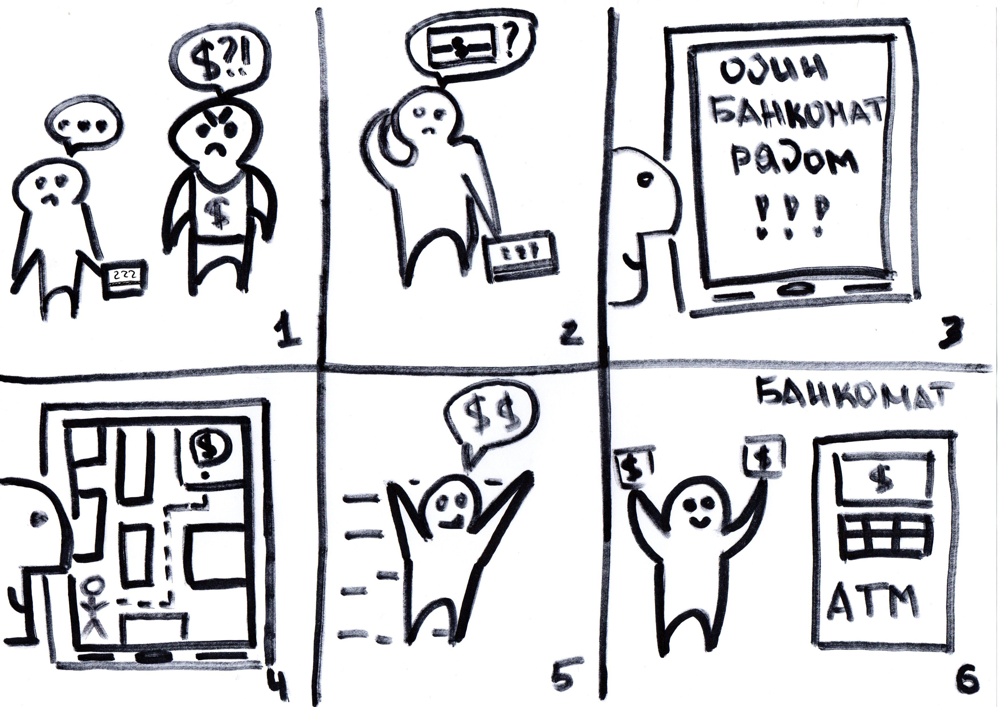

# Работу выполнили Морозов Денис и Криничный Дмитрий
# Выбранная раскадровка

Володя задолжал дяде Богдану. Дядя Богдан требует вернуть Володю деньги, причем наличными, но у Володи с собой только карта его банка. Поэтому Володя достает свой смартфон, запускает наше приложение и находит ближайший банкомат, в котором можно снять деньги, после чего возвращает долг дяде Богдану.

# Прототипы

Первый: https://ninjamock.com/s/KBT8MFx

Второй: https://ninjamock.com/s/9J71MFx

# Эвристическая оценка

Прототип 1. Форма главного меню

Критерий | Описание несоответствия
--- | --- 
Помощь и документация | Отсутствует общая информация о приложении и его возможностях

Прототип 1. Форма выбора карты/кошелька и форма выбора транспорта и предпочтений

Критерий | Описание несоответствия
--- | --- 
Гибкость и эффективность использования | Приложение не запоминает выбор пользователя, поэтому как новичок, так и опытный пользователь должны каждый раз выполнять одни и те же операции

Прототип 1. Форма найденного банкомата

Критерий | Описание несоответствия
--- | --- 
Свобода действий и контроль | Приложение не предлагает альтернативных банкоматов на выбор, а прокладывает маршрут к тому, который  лучше всего подходит условиям фильтра

Прототип 2. Форма логина

Критерий | Описание несоответствия
--- | ---
Профилактика ошибок | Никак не выделяются поля, если они не заполнены или заполнены некорректно

Прототип 2. Форма главного меню

Критерий | Описание несоответствия
--- | ---
Помощь и документация | Отсутствует общая информация о приложении и его возможностях

Прототип 2. Форма поиска банкомата

Критерий | Описание несоответствия
--- | ---
Отображение статуса системы | После нажатия кнопки "Найти банкомат" нигде в окне не появляется сообщение об успехе/неудаче операции, результат просто выводится на карту

Прототипы. Общие замечания

№ | Критерий | Оценка
--- | --- | ---
Прототип 1 | Ясность | 4
Прототип 1 | Законченность | 4
Прототип 2 | Ясность | 5
Прототип 2 | Законченность | 4
 | Степень различия прототипов | 4
